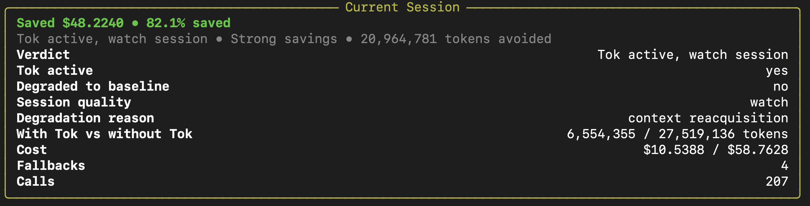
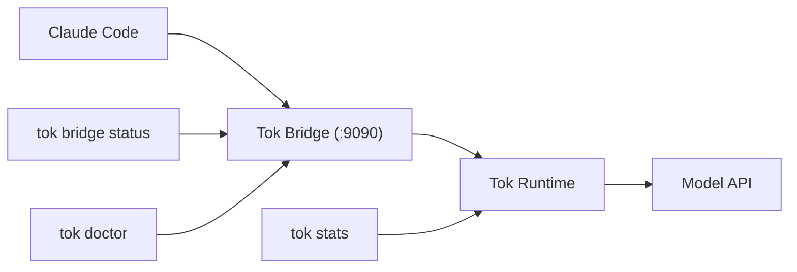

# Tok

[](https://github.com/tokmacher/tok/actions/workflows/ci.yml)
[](https://pypi.org/project/tok-protocol/)
[](https://pypi.org/project/tok-protocol/)
[](https://opensource.org/licenses/Apache-2.0)

**Tok cuts LLM token costs by 15–46% on sessions of 8+ turns, without altering your workflow.**

Savings come primarily from **input token compression** (prompt/context optimization) with additional savings from response compression. Short sessions (< 8 turns) default to baseline mode since compression overhead exceeds savings. Since most providers charge different rates for input vs output tokens, your actual cost reduction depends on your provider's pricing structure and session length.

Tok is an invisible bridge that sits between Claude Code and the model API. It compresses conversations on the way out and re-hydrates them on the way back. You use Claude exactly as before — Tok runs underneath, saving tokens automatically.

## Who Is Tok For?

- **Individual developers** using Claude Code who want to reduce token costs
- **Teams** with shared API budgets looking to stretch their token allowances
- **Power users** who work on long-running sessions where context accumulates

If you already use Claude Code, Tok works out of the box. No workflow changes required.

## What Tok Does

Tok intercepts LLM traffic and applies deterministic compression:

- **Semantic deduplication**: Repeated file reads, search results, and tool outputs are cached and stubbed
- **Delta compression**: Changed content shows only the diff, not the full payload
- **Rolling state**: Conversation history compresses to O(1) size regardless of length
- **Lossless round-trip**: Everything re-hydrates perfectly on the way back

The result: ~50% fewer tokens sent to the model, with no visible change to your workflow.

## Supported Workflow

The first open-source release supports exactly this path:

```bash
pip install tok-protocol
 tok install              # adds claude() shell wrapper
tok bridge start         # starts the bridge on port 9090
claude                   # use Claude exactly as before
tok bridge status        # check bridge health
tok doctor               # session diagnostics
tok bridge stop          # stop cleanly
tok stats                # view savings
```

After `tok install`, you run `claude` exactly as before. Tok intercepts traffic invisibly.

The main CLI commands for `0.1.0` are: `tok install`, `tok bridge start|status|logs|stop`, `tok doctor`, and `tok stats`.

## Using OpenRouter and Other Providers

Tok works with any OpenAI-compatible API. To use OpenRouter:

```bash
# Set your OpenRouter API key
export OPENROUTER_API_KEY=your_key_here

# Configure Claude Code to use OpenRouter (in ~/.claude/config or environment)
# Then start the bridge normally
tok bridge start
claude
```

Tok automatically detects the provider and applies compression. The same workflow works for:

- **OpenRouter** — access to 100+ models through a single API
- **DeepSeek** — set `DEEPSEEK_API_KEY` and configure your endpoint
- **Qwen** — set `QWEN_API_KEY` and configure your endpoint
- **Local models** — point Claude Code at your local inference server

No configuration changes required in Tok itself. Just set up Claude Code with your provider as usual, then start the bridge.

## What Tok Is / Is Not

**Tok is:**

- A deterministic compression layer (no lossy LLM summarization)
- A bridge-first CLI optimized for Claude Code
- A safety-first workflow with visible fallback and degradation signals

**Tok is not (yet):**

- A broad multi-agent framework
- A general-purpose SDK for arbitrary Python applications
- A replacement for your existing tools (it runs invisibly underneath them)

The bridge is the supported public workflow. A Python SDK path exists but is experimental.

## Demonstrated Savings

Here's an example of the `tok stats` output from a long session with heavy tool-result repetition (207 API calls):



This output from a high-repetition session shows the upper bound of savings. Typical results from benchmark testing across Claude Sonnet, GPT-4, and DeepSeek:

- **15–46% token savings** on sessions of 8+ turns (varies by model, mode, and workload)
- **Automatic baseline fallback** for short sessions where compression adds overhead
- **Fail-open safety** — if compression risks fidelity, Tok falls back to uncompressed

## Technical Overview

Tok achieves its compression through several deterministic techniques:

### Semantic Deduplication

- **Content hashing**: Identical tool results are detected via SHA-256 hashes and replaced with `>>> tool:name|unchanged|cached` stubs
- **Delta compression**: Changed results show only the diff: `>>> tool:name|delta|changed_lines:5`
- **Error normalization**: Similar errors collapse to canonical forms like `|err:enoent|`

### Macro System

- **Pattern recognition**: Repeated command sequences are automatically learned as macros
- **Cross-session persistence**: High-value macros survive bridge restarts and system reboots
- **Cross-workflow reuse**: Macros learned in one project automatically apply to new projects
- **ROI tracking**: Macros with lifetime savings > ROI_PROTECTION_THRESHOLD are preserved indefinitely
- **Durable promotion**: High-value macros graduate from hot memory to durable storage

### Wire Protocol

- **BPE-aligned sigils**: Single-character fields (`t:`, `g:`, `f:`) minimize token cost
- **Structured state**: `>>> t:2|g:refactor|f:src/main.py|cmds:pytest` encodes context efficiently
- **Lossless round-trip**: Tok state perfectly re-hydrates to original JSON/Markdown

### Memory Architecture

- **Hot/durable buckets**: Recent context vs. long-term knowledge with different decay rates
- **O(1) rolling state**: Constant-time updates regardless of conversation length
- **Fail-open safety**: Automatic fallback to baseline if compression risks fidelity

### Pointer System

- **Cross-reference tracking**: Automatically detects when files, functions, or concepts are referenced across the conversation
- **Implicit graph building**: Maintains relationships between entities without explicit user annotation
- **Context preservation**: Pointers ensure that when a file is mentioned later, its full context remains accessible
- **Memory efficiency**: References are stored as lightweight pointers rather than duplicating content

### Semantic Validation System

- **Invisible Pressure**: Quantifies protocol drift and cognitive overhead from repeated operations
- **Memory Lift**: Measures knowledge accumulation through structured memory promotions
- **Semantic Regression**: Detects when the model falls back to verbose, non-optimized responses
- **Real-time monitoring**: Continuous validation ensures Tok maintains its compression benefits

### Code Analysis (Sifter)

- **AST-based extraction**: Parses Python code to extract function signatures, type annotations, and structure
- **Verbatim hashing**: Generates compact fingerprints for identical code blocks
- **Structural analysis**: Identifies code patterns and relationships for intelligent compression
- **Cross-file understanding**: Maintains awareness of codebase structure across the conversation

## Tok Syntax Examples

### Wire Protocol State

```tok
>>> t:3|g:refactor|f:src/main.py|cmds:pytest|e:import_error
```

- Turn 3, goal is refactor, working on src/main.py, ran pytest, encountered import error

### Semantic Deduplication

```tok
# Original verbose result:
>>> tool:view_file|path:src/utils.py|unchanged|cached

# Delta compression:
>>> tool:edit_file|path:src/main.py|delta|changed_lines:5
--- a/src/main.py
+++ b/src/main.py
@@ -10,7 +10,7 @@
-def old_function():
+def new_function():
     return True
```

### Macro Usage

```tok
# Learned macro for testing workflow:
@run_tests(src="src/", coverage=True)
# Expands to: pytest src/ --cov=src --cov-report=html
```

### Pointer System

```tok
@pointers
  |> *A=src/main.py
  |> *B=DatabaseConnection
  |> *C=UserAuthentication

# References use lightweight pointers:
f:*A|cmds:pytest|b:*C
```

### Memory State

```tok
>>> t:5|g:implement_auth|f:*A,*B|cmds:npm_test|facts:*C handles JWT|next:add_middleware
```

## Prerequisites

- Python `3.10+`
- macOS or Linux
- Claude Code installed and available as `claude`
- An API key or provider configuration that Claude Code can already use

## Model Provider Support

Tok is validated and tested with:

- **Anthropic Claude** (primary target)
- **OpenAI GPT models**
- **DeepSeek**
- **Qwen**

Other OpenAI-compatible providers may work but are untested. If you use a different provider, Tok will attempt compression but behavior is not guaranteed.

`tok install` adds a `claude()` shell wrapper to `~/.zshrc` or `~/.bashrc`. It does
not replace the `tok` CLI itself.

**Note**: Due to recent issues around usage limits within Claude Code, it has been occasionally difficult to verify consistent Tok behavior across tasks (particularly short-running ones).

## Install

Public install target:

```bash
pip install tok-protocol
```

If you are working from a local checkout instead of PyPI:

```bash
pip install .
```

## Quickstart

Run this exact bridge-first flow:

```bash
tok install
source ~/.zshrc  # or source ~/.bashrc
tok bridge start
claude
tok bridge status
tok doctor
tok bridge stop
tok stats
```

The normal happy path is:

- `tok bridge status` says the bridge is running and Tok is active
- `tok doctor` ends with `Recommendation: keep Tok on`
- `tok stats` shows saved dollars, saved percent, and `With Tok vs without Tok`

Representative output:

```text
Bridge running on :9090 (PID 12345)
Saved $0.0123 • 48.1% saved
Verdict                Tok active and helping
Tok active             yes
Degraded to baseline   no
Fallbacks              0
```

If you see `Degraded to baseline: yes` or fallback counts rising, Tok protected the
session by serving requests without compression.

If `claude` is still not found after `tok install`, reload your shell with
`source ~/.zshrc` or `source ~/.bashrc` before debugging Tok itself.

## First 10 Minutes Troubleshooting

| If you see this                                     | Check this first                                              | Likely fix                                                                                                                    |
| --------------------------------------------------- | ------------------------------------------------------------- | ----------------------------------------------------------------------------------------------------------------------------- |
| `tok: command not found`                          | Was the package installed into the active Python environment? | Re-activate the environment and run `pip install tok-protocol` again.                                                       |
| `claude: command not found` after `tok install` | Was your shell reloaded?                                      | Run `source ~/.zshrc` or `source ~/.bashrc`, or open a new shell.                                                         |
| `Bridge not running`                              | Did `tok bridge start` succeed?                             | Restart with `tok bridge start --foreground` and inspect `tok bridge logs`.                                               |
| No savings visible yet                              | Is the session still very short?                              | Keep working for a few turns, then run `tok doctor` and `tok stats --last-session`, or `tok stats` for a lifetime view. |
| `Degraded to baseline: yes`                       | Did the session fall back for safety?                         | Run `tok doctor` first, then follow the steps in [`docs/troubleshooting.md`](docs/troubleshooting.md).                       |

## Clean-Room Install Verification

Use this when validating the package from scratch:

```bash
python -m venv .venv
source .venv/bin/activate
pip install tok-protocol
tok --help
tok install
tok bridge start --help
tok bridge status --help
tok stats --help
```

If you are validating a local release artifact instead of PyPI, build and install
the wheel from `dist/`:

```bash
python -m build
python -m venv .venv
source .venv/bin/activate
pip install dist/tok_protocol-0.1.0-py3-none-any.whl
tok --help
tok install
tok bridge start --help
tok bridge status --help
tok stats --help
```

In restricted or offline environments, a local wheel install still requires the
published dependencies to be available in the environment or via an internal
package mirror.

This is the minimum supported install bar for the first public release.

## Bridge Workflow



To compare the same workflow with no compression:

```bash
TOK_MODE=baseline tok bridge start
claude
tok stats
```

Baseline prices are calculated using current Openrouter USD rates.

## Mode Selection Guidelines

Tok operates in several modes, each optimized for different scenarios:

### Available Modes

- **baseline**: No compression. Use for debugging or measuring Tok's impact.
- **tok-minimal**: Lightweight compression with enhanced context preservation. Best for short sessions (5-10 turns).
- **tok-native**: Standard Tok compression with structured memory. Good balance of savings and fidelity.
- **tok-tool-compatible**: Maximum compression with tool-result caching. Best for long sessions (15+ turns) with repeated operations.
- **tok-neuro**: Experimental mode with advanced macro learning. For power users with recurring workflows.

### Automatic Mode Selection

Tok automatically selects the optimal mode based on session characteristics:

- **Short sessions (< 8 turns)**: Tok defaults to baseline to avoid compression overhead. The savings from compression don't outweigh the cost of maintaining structured state for very short conversations.
- **Medium sessions (8-15 turns)**: Tok-minimal or tok-native modes provide good savings while preserving context.
- **Long sessions (15+ turns)**: Tok-tool-compatible mode maximizes savings through aggressive caching and delta compression.

### Manual Mode Override

To manually select a mode:

```bash
TOK_MODE=tok-minimal tok bridge start
claude
```

### Recommendations by Use Case

| Use Case | Recommended Mode | Reason |
|----------|-----------------|--------|
| Quick questions (< 5 turns) | baseline | Overhead exceeds savings |
| Bug investigation (5-15 turns) | tok-minimal | Preserves context while saving tokens |
| Feature implementation (15-30 turns) | tok-native | Balanced savings and fidelity |
| Large refactoring (30+ turns) | tok-tool-compatible | Maximum savings from repeated reads |
| Recurring workflows (daily work) | tok-neuro | Learns and reuses macros |

### When to Stay on Baseline

Keep Tok in baseline mode if:
- You're debugging Tok itself
- You need exact token counts for pricing estimates
- The session is very short (< 5 turns)
- You're testing a new model provider

### Switching Modes Mid-Session

You can restart the bridge with a different mode at any time:

```bash
tok bridge stop
TOK_MODE=tok-tool-compatible tok bridge start
```

The new mode applies to subsequent requests. Existing session state is preserved.

## Experimental: Python SDK Path

> **Note**: This path is experimental and not the primary workflow. The bridge-first CLI above is the supported release surface.

For programmatic use outside Claude Code, Tok exposes a minimal SDK:

1. Create one `RuntimeSession`
2. Call `tok.wrap(...)` to prepare a request
3. Send through your OpenAI-compatible client
4. Call `tok.process(...)` on the response
5. Reuse the same session for subsequent turns

See [`examples/tok_wrap_example.py`](examples/tok_wrap_example.py) and
[`examples/README.md`](examples/README.md).

## Docs Map

Start here, then go deeper only if you need it:

- [`docs/bridge.md`](docs/bridge.md): full bridge tutorial
- [`docs/cli-reference.md`](docs/cli-reference.md): command reference
- [`docs/troubleshooting.md`](docs/troubleshooting.md): fallback, degraded sessions, logs, savings interpretation
- [`docs/production-readiness.md`](docs/production-readiness.md): advanced runtime defaults and release posture
- [`docs/release-checklist.md`](docs/release-checklist.md): maintainer release checklist
- [`docs/public-release-decision.md`](docs/public-release-decision.md): supported workflows, limitations, and release bar
- [`docs/maintainers/README.md`](docs/maintainers/README.md): roadmap and internal planning docs

## Repo Map

The repository is intentionally split by audience and lifecycle:

- `src/tok/`: runtime, bridge, CLI, and library code
- `docs/`: public product docs plus release/reference docs
- `docs/maintainers/`: roadmap, refactoring notes, and maintainer-only planning
- `examples/`: experimental wrapper/API examples outside the default bridge-first path
- `tests/`: unit, integration, replay, and stability coverage
- `archive/`: curated historical research and superseded implementation records, kept for provenance and excluded from the release surface

## Validation Workflow

After working on the codebase, run the full validation flow using `uv run` to execute the core regression suite, lint, and type checks:

```bash
pre-commit run --all-files
uv run python -m pytest tests/unit/test_architecture.py tests/unit/validation_metrics.py tests/unit/test_adversarial.py tests/unit/test_memory_growth.py tests/unit/test_bridge_fidelity.py tests/unit/test_encoder_transformer.py tests/unit/test_schema_validation.py tests/unit/test_sifter.py tests/unit/test_error_handling.py -v
uv run ruff check src/tok/ tests/unit
uv run mypy src/tok/
```

## Privacy

Tok runs locally. No data leaves your machine except the model/API calls you would already make.

## License

Apache License, Version 2.0
