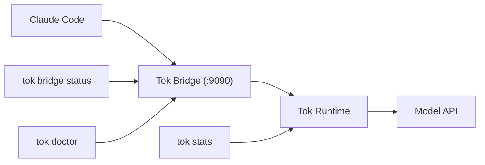

# Tok

[](https://github.com/tokmacher/tok/actions/workflows/ci.yml)
[](https://pypi.org/project/tok-protocol/)
[](https://pypi.org/project/tok-protocol/)
[](https://opensource.org/licenses/Apache-2.0)

**Tok is a high-density, BPE-aligned wire protocol that cuts LLM token costs by ~50% without altering your workflow.**

This repository contains the Tok protocol and its first official implementation: an invisible, bridge-first CLI for **Claude Code**. It intercepts standard LLM traffic, translates verbose JSON/Markdown into highly compressed Tok sigils over the wire, and perfectly re-hydrates it for the user.

The result is an O(1) rolling state that massively expands your effective context window, preserves useful working memory, and makes token savings visible immediately.

Tok is an invisible bridge that lets you do more without getting in the way.

The first open-source release is intentionally narrow:

- install a Python package
- add the `claude()` shell wrapper
- start the bridge
- use Claude normally
- check `tok bridge status`, `tok doctor`, and `tok stats`
- stop the bridge cleanly

The default CLI help is intentionally narrow too. For `0.1.0`, the main public
commands are `tok install`, `tok bridge ...`, `tok doctor`, `tok stats`, and the
compatibility alias `tok savings`.

## What Tok Is / Is Not

**Tok is:**

- A deterministic syntactic compression layer (it does not use lossy LLM summarization).
- A bridge-first CLI optimized currently for Claude Code.
- A safety-first workflow with visible fallback and degradation signals (Fail-Open).

**Tok is not (yet):**

- A broad multi-agent framework.
- A fully polished SDK-first product for general Python usage.
- A replacement for your existing tools (it runs invisibly underneath them).

The bridge is the supported public workflow today. The Python wrapper/SDK path exists,
but it is still experimental and secondary.

## Demonstrated Savings

Here's an example of the `tok stats` output, showcasing the significant cost and token savings achieved in a real session:


This output clearly illustrates the financial benefits and token efficiency of using Tok:

- **$48.22 saved (82.1% reduction)** from 207 API calls
- **20.9M tokens avoided** through compression
- **6.5M vs 27.5M tokens** comparing Tok vs baseline
- **Preserved workflow** via Claude Code CLI

## Technical Overview

Tok achieves its compression through several deterministic techniques:

### Semantic Deduplication
- **Content hashing**: Identical tool results are detected via SHA-256 hashes and replaced with `>>> tool:name|unchanged|cached` stubs
- **Delta compression**: Changed results show only the diff: `>>> tool:name|delta|changed_lines:5`  
- **Error normalization**: Similar errors collapse to canonical forms like `|err:enoent|`

### Macro System
- **Pattern recognition**: Repeated command sequences are automatically learned as macros
- **Cross-session persistence**: High-value macros survive bridge restarts and system reboots
- **Cross-workflow reuse**: Macros learned in one project automatically apply to new projects
- **ROI tracking**: Macros with lifetime savings > ROI_PROTECTION_THRESHOLD are preserved indefinitely
- **Durable promotion**: High-value macros graduate from hot memory to durable storage

### Wire Protocol
- **BPE-aligned sigils**: Single-character fields (`t:`, `g:`, `f:`) minimize token cost
- **Structured state**: `>>> t:2|g:refactor|f:src/main.py|cmds:pytest` encodes context efficiently
- **Lossless round-trip**: Tok state perfectly re-hydrates to original JSON/Markdown

### Memory Architecture
- **Hot/durable buckets**: Recent context vs. long-term knowledge with different decay rates
- **O(1) rolling state**: Constant-time updates regardless of conversation length
- **Fail-open safety**: Automatic fallback to baseline if compression risks fidelity

### Pointer System
- **Cross-reference tracking**: Automatically detects when files, functions, or concepts are referenced across the conversation
- **Implicit graph building**: Maintains relationships between entities without explicit user annotation
- **Context preservation**: Pointers ensure that when a file is mentioned later, its full context remains accessible
- **Memory efficiency**: References are stored as lightweight pointers rather than duplicating content

### Semantic Validation System
- **Invisible Pressure**: Quantifies protocol drift and cognitive overhead from repeated operations
- **Memory Lift**: Measures knowledge accumulation through structured memory promotions
- **Semantic Regression**: Detects when the model falls back to verbose, non-optimized responses
- **Real-time monitoring**: Continuous validation ensures Tok maintains its compression benefits

### Code Analysis (Sifter)
- **AST-based extraction**: Parses Python code to extract function signatures, type annotations, and structure
- **Verbatim hashing**: Generates compact fingerprints for identical code blocks
- **Structural analysis**: Identifies code patterns and relationships for intelligent compression
- **Cross-file understanding**: Maintains awareness of codebase structure across the conversation

## Prerequisites

- Python `3.10+`
- macOS or Linux
- Claude Code installed and available as `claude`
- a provider/API configuration that Claude Code can already use

`tok install` adds a `claude()` shell wrapper to `~/.zshrc` or `~/.bashrc`. It does
not replace the real `tok` CLI.

## Install

Public install target:

```bash
pip install tok-protocol
```

If you are working from a local checkout instead of PyPI:

```bash
pip install .
```

## Quickstart

Run this exact bridge-first flow:

```bash
tok install
source ~/.zshrc  # or source ~/.bashrc
tok bridge start
claude
tok bridge status
tok doctor
tok bridge stop
tok stats
```

The normal happy path is:

- `tok bridge status` says the bridge is running and Tok is active
- `tok doctor` ends with `Recommendation: keep Tok on`
- `tok stats` shows saved dollars, saved percent, and `With Tok vs without Tok`

Representative output:

```text
Bridge running on :9090 (PID 12345)
Saved $0.0123 • 48.1% saved
Verdict                Tok active and helping
Tok active             yes
Degraded to baseline   no
Fallbacks              0
```

If you see `Degraded to baseline: yes` or fallback counts rising, Tok protected the
session by serving requests without compression.

If `claude` is still not found after `tok install`, reload your shell with
`source ~/.zshrc` or `source ~/.bashrc` before debugging Tok itself.

## First 10 Minutes Troubleshooting

| If you see this                                     | Check this first                                              | Likely fix                                                                                                                    |
| --------------------------------------------------- | ------------------------------------------------------------- | ----------------------------------------------------------------------------------------------------------------------------- |
| `tok: command not found`                          | Was the package installed into the active Python environment? | Re-activate the environment and run `pip install tok-protocol` again.                                                       |
| `claude: command not found` after `tok install` | Was your shell reloaded?                                      | Run `source ~/.zshrc` or `source ~/.bashrc`, or open a new shell.                                                         |
| `Bridge not running`                              | Did `tok bridge start` succeed?                             | Restart with `tok bridge start --foreground` and inspect `tok bridge logs`.                                               |
| No savings visible yet                              | Is the session still very short?                              | Keep working for a few turns, then run `tok doctor` and `tok stats --last-session`, or `tok stats` for a lifetime view. |
| `Degraded to baseline: yes`                       | Did the session fall back for safety?                         | Run `tok doctor` first, then follow the steps in [`docs/troubleshooting.md`](docs/troubleshooting.md).                       |

## Clean-Room Install Verification

Use this when validating the package from scratch:

```bash
python -m venv .venv
source .venv/bin/activate
pip install tok-protocol
tok --help
tok install
tok bridge start --help
tok bridge status --help
tok stats --help
```

This is the minimum supported install bar for the first public release.

## Bridge Workflow



To compare the same workflow with no compression:

```bash
TOK_MODE=baseline tok bridge start
claude
tok stats
```

Baseline prices are calculated using current Openrouter USD rates.

## Experimental Python Recipe

The SDK-facing path is available, but it is not the primary public workflow yet.

The minimal recipe is:

1. create one `RuntimeSession`
2. call `tok.wrap(...)`
3. prepend `prepared.body["system"]` when present and append `prepared.body["messages"]`
4. send the request through an OpenAI-compatible client
5. call `tok.process(...)`
6. reuse the same session on the next turn

See [`examples/tok_wrap_example.py`](examples/tok_wrap_example.py) and
[`examples/README.md`](examples/README.md). That is the only shipped example path for
the first public release.

## Docs Map

Start here, then go deeper only if you need it:

- [`docs/bridge.md`](docs/bridge.md): full bridge tutorial
- [`docs/cli-reference.md`](docs/cli-reference.md): command reference
- [`docs/troubleshooting.md`](docs/troubleshooting.md): fallback, degraded sessions, logs, savings interpretation
- [`docs/production-readiness.md`](docs/production-readiness.md): advanced runtime defaults and release posture
- [`docs/release-checklist.md`](docs/release-checklist.md): maintainer release checklist
- [`docs/public-release-decision.md`](docs/public-release-decision.md): supported workflows, limitations, and release bar
- [`docs/maintainers/README.md`](docs/maintainers/README.md): roadmap and internal planning docs

## Repo Map

The repository is intentionally split by audience and lifecycle:

- `src/tok/`: runtime, bridge, CLI, and library code
- `docs/`: public product docs plus release/reference docs
- `docs/maintainers/`: roadmap, refactoring notes, and maintainer-only planning
- `examples/`: experimental wrapper/API examples outside the default bridge-first path
- `tests/`: unit, integration, replay, and stability coverage
- `archive/`: curated historical research and superseded implementation records, kept for provenance and excluded from the release surface

## Validation Workflow

After working on the codebase, run the full validation flow using `uv run` to execute the core regression suite, lint, and type checks:

```bash
pre-commit run --all-files
uv run python -m pytest tests/unit/test_architecture.py tests/unit/validation_metrics.py tests/unit/test_adversarial.py tests/unit/test_memory_growth.py tests/unit/test_bridge_fidelity.py tests/unit/test_encoder_transformer.py tests/unit/test_schema_validation.py tests/unit/test_sifter.py tests/unit/test_error_handling.py -v
uv run ruff check src/tok/ tests/unit
uv run mypy src/tok/
```

## Privacy

Tok runs locally. No data leaves your machine except the model/API calls you would
already make.

## License

Apache License, Version 2.0
