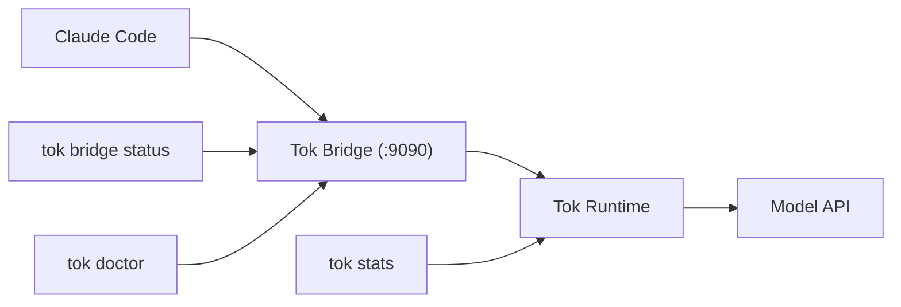

# Tok

[](https://github.com/tokmacher/tok/actions/workflows/ci.yml)
[](https://pypi.org/project/tok-protocol/)
[](https://pypi.org/project/tok-protocol/)
[](https://opensource.org/licenses/Apache-2.0)

AI agent tools still pass around context as if every reader were human.

Long-running coding-agent sessions often resend verbose transcripts, tool outputs, file
reads, search results, and status text on every turn. But in many agent loops, the next
reader is another model. Tok is a local bridge that explores a better runtime shape:
compact, deterministic, model-facing state instead of repeated human-facing context.

For the 0.1.x release, Tok focuses on one narrow path: Claude Code routed through a
local bridge. It reduces repeated context where it can do so safely, preserves the
normal Claude Code workflow, and fails open when compression would risk fidelity.

Token and cost savings are a meaningful result of this approach, but they follow from
the core idea rather than defining it. Savings come primarily from input-token
compression (prompt/context optimization) with additional savings from response
compression. Since providers charge different rates for input vs. output tokens, actual
cost reduction depends on your provider's pricing structure and session length.

## Why Tok Exists

Human-facing output is useful at the edges of a system, where a person reads the result.
Inside an agent loop, however, repeated state should be compact, structured, replayable,
and auditable. Resending the same file contents, search results, or tool outputs
verbatim on every turn is wasteful IO between two machines.

Tok tests that idea through a narrow Claude Code bridge path. It intercepts
conversations, compresses repeated and redundant context using deterministic rules (not
LLM summarization), and passes compact state to the model. Tok preserves the
request/response shape Claude Code expects, and falls back to baseline when it cannot
safely do so.

This is a bridge-layer experiment, not a framework. The 0.1.x release is deliberately
narrow to keep claims testable and the supported surface small.

## Quickstart

The supported 0.1.x workflow:

```bash
pip install tok-protocol
tok init                  # optional: create .tok/ workspace and .env
tok install               # setup/migration helper (no wrapper by default)
tok bridge start          # starts the bridge on port 9090
ANTHROPIC_BASE_URL=http://localhost:9090 claude
tok bridge status         # check bridge health
tok doctor                # session diagnostics
tok bridge stop           # stop cleanly
tok stats                 # view savings
tok audit --latest        # inspect the newest Tok Trace sidecar, if tracing is enabled
```

Default behavior is explicit. Tok does not override `claude` unless you opt in with
`tok install --wrap-claude`.

The main CLI commands for `0.1.x` are: `tok init`, `tok install`,
`tok bridge start|status|logs|stop`, `tok doctor`, `tok stats`, and `tok audit`. Tok is
not a graph-memory product, repo indexer, prompt-compression API, MCP server
marketplace, or general agent platform. For comparisons with native Claude Code
compaction and adjacent context tools, see
[`docs/claude-compaction-comparison.md`](docs/claude-compaction-comparison.md) and
[`docs/positioning-context-tools.md`](docs/positioning-context-tools.md).

### Optional Wrapper Mode

```bash
tok install --wrap-claude
source ~/.zshrc  # or source ~/.bashrc
claude
```

### Expected Output

The normal happy path:

- `tok bridge status` says the bridge is running and Tok is active
- `tok doctor` ends with `Recommendation: keep Tok on`
- `tok stats` shows saved dollars, saved percent, and `With Tok vs without Tok`

Representative output:

```text
Bridge running on :9090 (PID 12345)
Saved $0.0123 • 48.1% saved
Verdict                Tok active and helping
Tok active             yes
Degraded to baseline   no
Fallbacks              0
```

If you see `Degraded to baseline: yes` or fallback counts rising, Tok protected the
session by serving requests without compression.

### Trace Audit

Tok can write a sidecar trace of bridge behavior so you can inspect what happened
without changing the Claude Code workflow:

```bash
TOK_TRACE=1 TOK_TRACE_CAPTURE_ARTIFACTS=1 tok bridge start
ANTHROPIC_BASE_URL=http://localhost:9090 claude
tok audit --latest
```

`TOK_TRACE=1` writes draft Tok Trace JSONL files under `~/.tok/traces/`.
`TOK_TRACE_CAPTURE_ARTIFACTS=1` adds sanitized metadata artifacts so `tok audit` can
verify trace hashes and byte sizes locally. Tok does not capture raw prompts, responses,
or tool outputs in this mode. `tok audit` is for inspecting what Tok did during a bridge
run; it is not a universal protocol compliance certificate.

If you enabled wrapper mode and `claude` is still not found, reload your shell with
`source ~/.zshrc` or `source ~/.bashrc` before debugging Tok itself.

## Who Is Tok For?

- **Individual developers** using Claude Code who want to reduce token costs
- **Teams** with shared API budgets looking to stretch their token allowances
- **Power users** who work on long-running sessions where context accumulates
- **Developers** interested in AI runtime efficiency and compact model-facing state
- **Anyone** who prefers a local, inspectable bridge rather than a hosted service

If you already use Claude Code, Tok is a small add-on: start the bridge and point Claude
at it via `ANTHROPIC_BASE_URL=http://localhost:9090`.

## What Tok Does

Tok intercepts LLM traffic and applies deterministic compression:

- **Semantic deduplication**: Repeated file reads, search results, and tool outputs are
  cached and stubbed
- **Delta compression**: Changed content shows only the diff, not the full payload
- **Rolling state**: Conversation history is capped at a fixed memory footprint. Entries
  only drop when the cap is reached after very long sessions. Practical conversations
  are effectively unlimited.
- **Designed for round-trip fidelity**: Tok is designed to preserve the visible Claude
  Code workflow. When Tok cannot safely preserve fidelity, it falls back to baseline.
  The supported bridge path is covered by fidelity and smoke tests.

The result is typically lower token volume on sustained sessions, while preserving the
bridge-first Claude workflow.

## Design Principles

- **Model-facing state should be compact.** Verbose human-shaped context is expensive
  and unnecessary when the reader is a model.
- **Human-facing output belongs at the edges.** Generate it where a person reads it, not
  in every internal hop.
- **Compression must be deterministic.** No LLM summarization. Rules are repeatable and
  auditable.
- **Fail open rather than corrupt context.** When fidelity is at risk, Tok serves
  requests without compression and signals the fallback.
- **Narrow supported surface before broad provider expansion.** Claude Code bridge-first
  for 0.1.x.
- **Measure savings honestly.** Workload-dependent, with upper-bound examples clearly
  labeled.

## Demonstrated Savings

Here is an example of the `tok stats` output from a long session with heavy tool-result
repetition (207 API calls). This is **not typical**: it represents an upper bound from a
highly repetitive workload.


This output from a high-repetition session shows an upper-bound example. Your actual
savings depend on session length, tool usage patterns, and provider pricing:

- **Typical sessions (8+ turns)**: meaningful input-token savings on sustained work with
  repeated file reads and search operations
- **Short sessions (< 8 turns)**: Tok defaults to baseline since compression overhead
  exceeds savings
- **Fail-open safety**: if compression risks fidelity, Tok falls back to uncompressed

Savings are workload-dependent. Repetitive long-running sessions benefit most; short
sessions may intentionally run at baseline.

See:

- [`docs/claims_matrix.md`](./docs/claims_matrix.md) for detailed claim evidence and
  status
- [`docs/pricing_verification.md`](./docs/pricing_verification.md) for pricing
  methodology
- [`docs/live_smoke_matrix.md`](./docs/live_smoke_matrix.md) for automated smoke test
  results

## What Tok Is / Is Not

**Tok is:**

- A deterministic compression layer (no lossy LLM summarization)
- A bridge-first CLI optimized for Claude Code
- A safety-first workflow with visible fallback and degradation signals

**Tok is not (yet):**

- A broad multi-agent framework
- A general-purpose SDK for arbitrary Python applications
- A replacement for your existing tools (it runs underneath them)

The bridge is the supported public workflow. A Python SDK path exists but is
experimental.

## Provider Posture

The supported `0.1.x` product path is **Claude Code routed through the local Tok
bridge**.

Tok can also be pointed at OpenAI-compatible APIs, but for the 0.1.x release those paths
are **validation-only** and explicitly outside the supported default story. Treat them
as experimental unless a future release promotes them into the supported surface.

Experimental validation may be useful for:

- OpenRouter and other OpenAI-compatible endpoints
- DeepSeek or Qwen endpoints you already operate
- Local inference servers that mimic the Anthropic/OpenAI-style request shape

These paths are not part of the supported `0.1.x` onboarding flow, are not surfaced in
the default CLI help, and may change without compatibility guarantees.

`tok install` is a setup/migration helper and does not modify `claude` by default. If
you want legacy auto-routing behavior, run `tok install --wrap-claude`.

## Technical Overview

Tok achieves its compression through several deterministic techniques:

### Semantic Deduplication

- **Content hashing**: Identical tool results are detected via SHA-256 hashes and
  replaced with `>>> tool:name|unchanged|cached` stubs
- **Delta compression**: Changed results show only the diff:
  `>>> tool:name|delta|changed_lines:5`
- **Error normalization**: Similar errors collapse to canonical forms like
  `|err:enoent|`

### Macro System (Experimental)

- **Pattern recognition**: Repeated command sequences are automatically learned as
  macros
- **Cross-session persistence**: High-value macros survive bridge restarts
- **ROI tracking**: Macros with lifetime savings above a threshold are preserved

> **Note**: The macro system is active in the runtime pipeline but not part of the
> supported 0.1.x surface. Its behavior may change.

### Wire Protocol

- **BPE-aligned sigils**: Single-character fields (`t:`, `g:`, `f:`) minimize token cost
- **Structured state**: `>>> t:2|g:refactor|f:src/main.py|cmds:pytest` encodes context
  efficiently
- **Round-trip fidelity**: Tok state is designed to preserve the supported bridge
  workflow, with fallback when fidelity cannot be guaranteed

### Memory Architecture

- **Hot/durable buckets**: Recent context vs. long-term knowledge with different decay
  rates
- **Bounded rolling state**: Updates are constant-time; memory caps at ~600 hot + ~2000
  durable entries. Most practical sessions stay well below the cap.
- **Fail-open safety**: Automatic fallback to baseline if compression risks fidelity

### Pointer System (Experimental)

Internal cross-reference tracking for files, functions, and concepts. Not part of the
supported 0.1.x surface.

### Code Analysis (Sifter)

Internal AST-based extraction for Python code structure. Used by the compression engine
but not part of the supported 0.1.x public API.

## Tok Syntax Examples

### Wire Protocol State

```tok
>>> t:3|g:refactor|f:src/main.py|cmds:pytest|e:import_error
```

- Turn 3, goal is refactor, working on src/main.py, ran pytest, encountered import error

### Semantic Deduplication

```tok
# Original verbose result:
>>> tool:view_file|path:src/utils.py|unchanged|cached

# Delta compression:
>>> tool:edit_file|path:src/main.py|delta|changed_lines:5
--- a/src/main.py
+++ b/src/main.py
@@ -10,7 +10,7 @@
-def old_function():
+def new_function():
     return True
```

### Macro Usage

```tok
# Learned macro for testing workflow:
@run_tests(src="src/", coverage=True)
# Expands to: pytest src/ --cov=src --cov-report=html
```

These examples illustrate the internal wire protocol. Users do not write Tok syntax
directly. The bridge handles all encoding and decoding transparently.

## Prerequisites

- Python `3.10`-`3.12` (tested for `0.1.x`)
- macOS or Linux
- Claude Code installed and available as `claude`
- An Anthropic API key (`ANTHROPIC_API_KEY`) already configured for Claude Code

Tok is a proxy. It does not manage API keys. It forwards whatever credentials Claude
Code already uses. If `claude` works without Tok, it will work with Tok.

## Install

Public install target:

```bash
pip install tok-protocol
```

If you are working from a local checkout instead of PyPI:

```bash
pip install .
```

### Clean-Room Install Verification

Use this when validating the package from scratch:

```bash
python -m venv .venv
source .venv/bin/activate
pip install tok-protocol
tok --version
tok --help
tok install
tok bridge start --help
tok bridge status --help
tok stats --help
```

If you are validating a local release artifact instead of PyPI, build and install the
wheel from `dist/`:

```bash
python -m build
python -m venv .venv
source .venv/bin/activate
pip install dist/tok_protocol-*.whl
tok --version
tok --help
tok install
tok bridge start --help
tok bridge status --help
tok stats --help
```

In restricted or offline environments, a local wheel install still requires the
published dependencies to be available in the environment or via an internal package
mirror.

This is the minimum supported install bar for the first public release.

## Troubleshooting

| If you see this                                               | Check this first                                              | Likely fix                                                                                                              |
| ------------------------------------------------------------- | ------------------------------------------------------------- | ----------------------------------------------------------------------------------------------------------------------- |
| `tok: command not found`                                      | Was the package installed into the active Python environment? | Re-activate the environment and run `pip install tok-protocol` again.                                                   |
| `claude: command not found` after `tok install --wrap-claude` | Was your shell reloaded?                                      | Run `source ~/.zshrc` or `source ~/.bashrc`, or open a new shell.                                                       |
| `Bridge not running`                                          | Did `tok bridge start` succeed?                               | Restart with `tok bridge start --foreground` and inspect `tok bridge logs`.                                             |
| No savings visible yet                                        | Is the session still very short?                              | Keep working for a few turns, then run `tok doctor` and `tok stats --last-session`, or `tok stats` for a lifetime view. |
| `Degraded to baseline: yes`                                   | Did the session fall back for safety?                         | Run `tok doctor` first, then follow the steps in [`docs/troubleshooting.md`](docs/troubleshooting.md).                  |

## Bridge Workflow



To compare the same workflow with no compression:

```bash
TOK_MODE=baseline tok bridge start
ANTHROPIC_BASE_URL=http://localhost:9090 claude
tok stats
```

Pricing estimates depend on the configured provider/model rates. See
[`docs/pricing_verification.md`](docs/pricing_verification.md) for methodology.

## Mode Selection

Tok supports two modes via the `TOK_MODE` environment variable:

- **`tool-compatible`** (default): Applies compression with a `natural_first` request
  policy. This is the recommended mode and the only supported mode for 0.1.x.
- **`baseline`**: No compression. All requests pass through unchanged. Use for
  debugging, measuring Tok's impact, or short sessions where compression overhead
  exceeds savings.

### When to Use Baseline

Set `TOK_MODE=baseline` if:

- You're debugging Tok itself
- You need exact token counts for pricing estimates
- The session is very short (< 5 turns)
- You're testing a new model provider

```bash
TOK_MODE=baseline tok bridge start
```

### Switching Modes Mid-Session

You can restart the bridge with a different mode at any time:

```bash
tok bridge stop
tok bridge start
```

The new mode applies to subsequent requests. Existing session state is preserved.

## Experimental: Python Submodule APIs

> **Note**: These APIs are experimental. They are not part of the supported `0.1.x`
> contract, are intentionally absent from the root `tok` namespace, and may change
> without compatibility guarantees.

For advanced evaluation work outside the bridge-first CLI, use explicit submodule
imports such as:

- `tok.runtime.core.RuntimeSession`
- `tok.runtime.types.RuntimeRequest`
- `tok.universal_runtime.UniversalTokRuntime`

See [`examples/tok_wrap_example.py`](examples/tok_wrap_example.py) and
[`examples/README.md`](examples/README.md) for the current experimental examples.

## Docs Map

Start here, then go deeper only if you need it:

- [`docs/bridge.md`](docs/bridge.md): full bridge tutorial
- [`docs/cli-reference.md`](docs/cli-reference.md): command reference
- [`docs/troubleshooting.md`](docs/troubleshooting.md): fallback, degraded sessions,
  logs, savings interpretation
- [`docs/claude-compaction-comparison.md`](docs/claude-compaction-comparison.md): how to
  compare Tok with Claude Code `/compact`, auto-compaction, and baseline mode
- [`docs/positioning-context-tools.md`](docs/positioning-context-tools.md): adjacent
  memory, context, compression, MCP, code-indexing, and observability tools
- [`docs/production-readiness.md`](docs/production-readiness.md): advanced runtime
  defaults and release posture
- [`docs/release-checklist.md`](docs/release-checklist.md): maintainer release checklist
- [`docs/public-release-decision.md`](docs/public-release-decision.md): supported
  workflows, limitations, and release bar
- [`docs/maintainers/README.md`](docs/maintainers/README.md): roadmap and internal
  planning docs

## Repo Map

The repository is intentionally split by audience and lifecycle:

- `src/tok/`: runtime, bridge, CLI, and library code
- `docs/`: public product docs plus release/reference docs
- `docs/maintainers/`: roadmap, refactoring notes, and maintainer-only planning
- `examples/`: experimental wrapper/API examples outside the default bridge-first path
- `tests/`: unit, integration, replay, and stability coverage

## Validation Workflow

After working on the codebase, run the full validation flow using `uv run` to execute
the core regression suite, lint, and type checks:

```bash
uv run pre-commit run --all-files
uv run python -m pytest tests/unit/test_architecture.py tests/unit/validation_metrics.py tests/unit/test_adversarial.py tests/unit/test_memory_growth.py tests/unit/test_bridge_fidelity.py tests/unit/test_encoder_transformer.py tests/unit/test_schema_validation.py tests/unit/test_sifter.py tests/unit/test_error_handling.py -v
uv run ruff check src/tok/ tests/unit
uv run mypy src/tok/
```

## Privacy

Tok runs locally. No data leaves your machine except the model/API calls you would
already make.

## Support Tok

Tok exists because I ran into a real problem and wanted to solve it: preserving the
normal Claude Code workflow while reducing wasted context and token spend where it is
safe to do so. The goal is to keep Tok open source and useful first.

If Tok helps you, the most helpful support is:

- Star the repo and share it with people who would benefit
- File issues, report regressions, and share benchmark results
- Contribute docs, tests, or fixes
- Use any sponsorship links listed here in the future if you want to help fund ongoing
  maintenance

Support is appreciated, but not expected. If Tok saves you money or makes your workflow
less frustrating, that is why it is here.

## License

Apache License, Version 2.0
