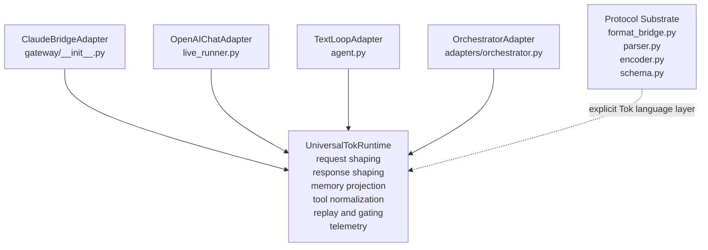
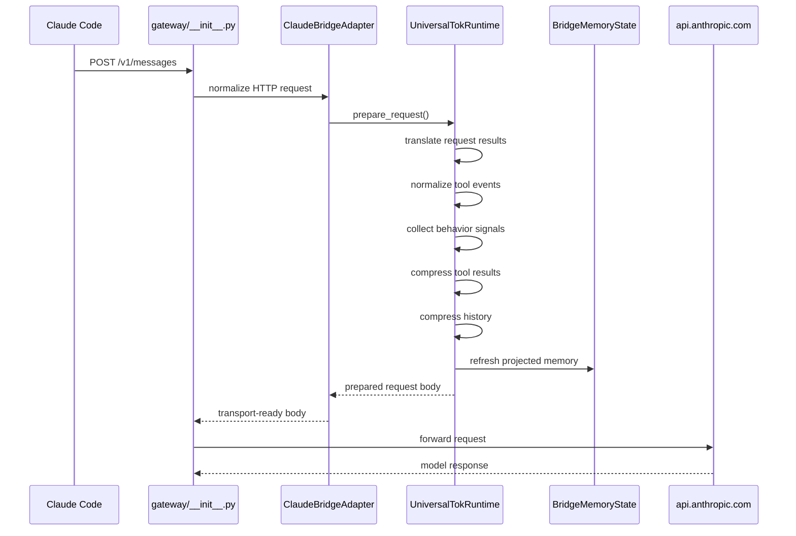
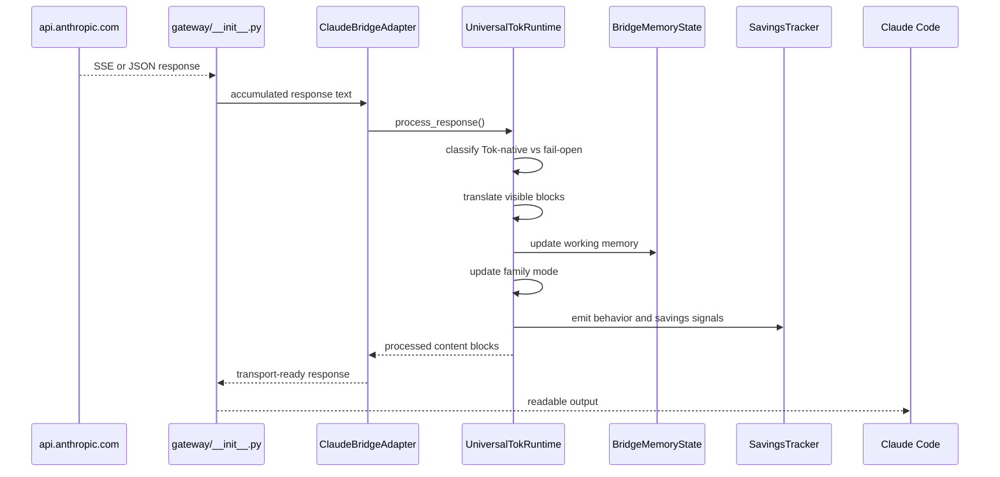
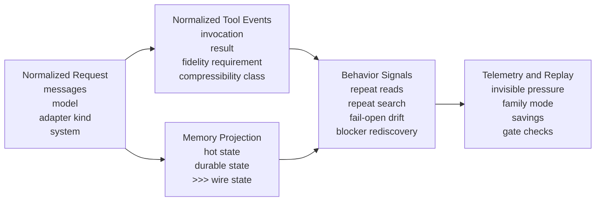
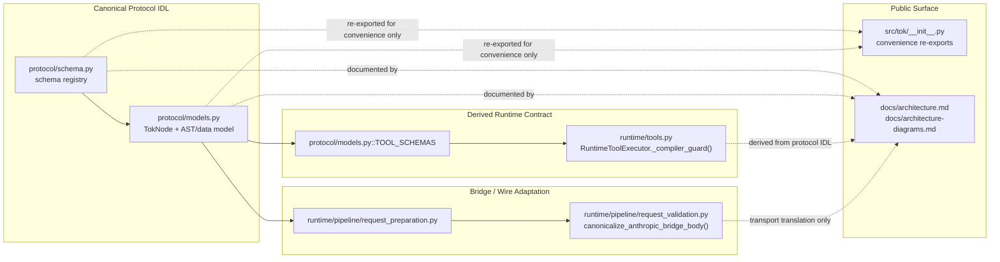
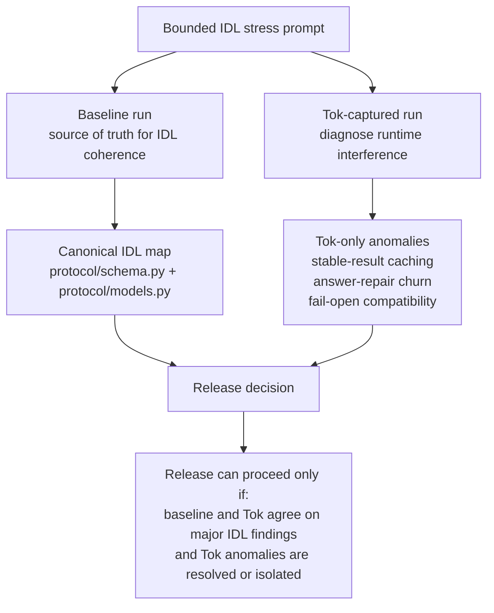
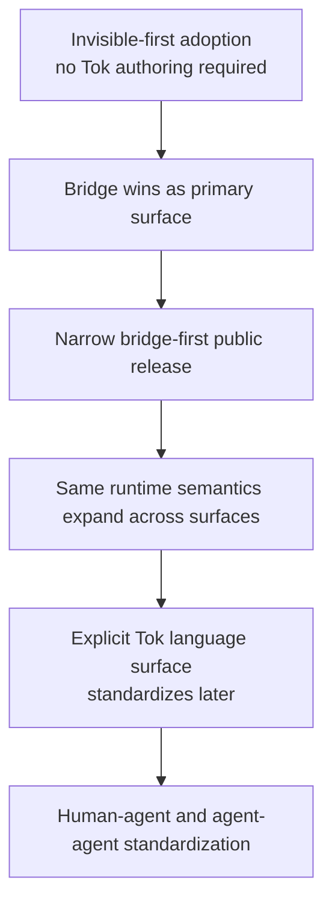

# Architecture Diagrams

This page is the visual companion to [architecture.md](./architecture.md). It shows the post-refactor system as it exists after the universal runtime consolidation.

## 1. Runtime Topology

## 2. Primary Claude Bridge Request Flow

## 3. Primary Claude Bridge Response Flow

## 4. Memory, Tools, and Telemetry Ontology

## 5. Canonical IDL Ownership

## 6. Paired IDL Audit Gate

## 7. Deferred Orchestrator Migration Boundary

The release-surface manifest in `src/tok/release_surface.py` defines which exports
and commands are supported versus experimental for the first public release.

## 8. Adoption Story

______________________________________________________________________

See the repository root `roadmap.md` for latest planning and phase status.
