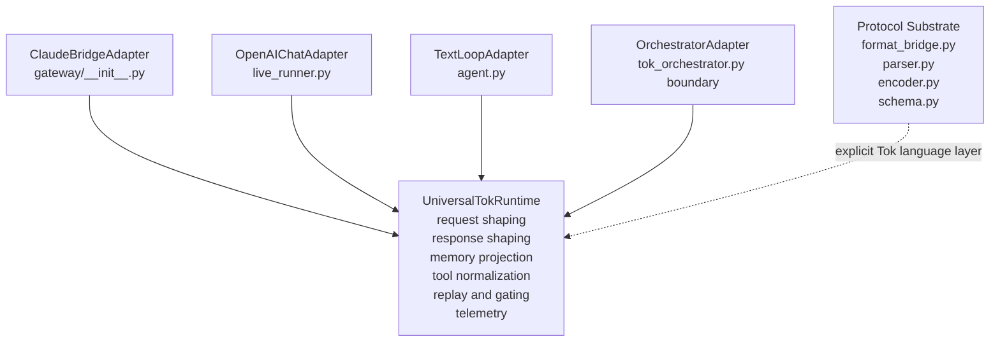
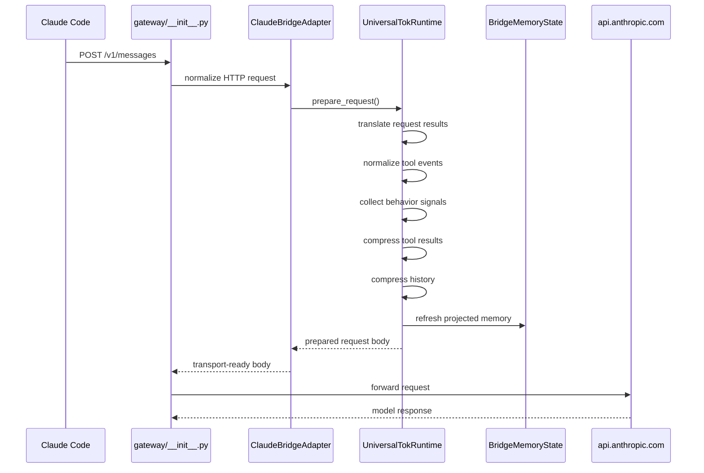
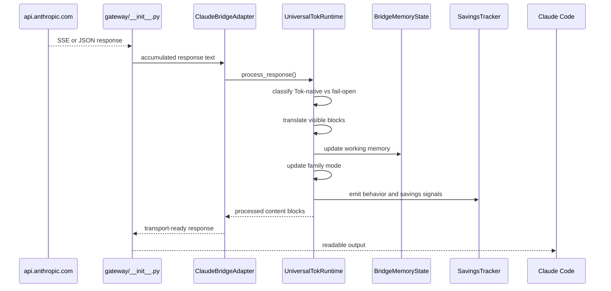
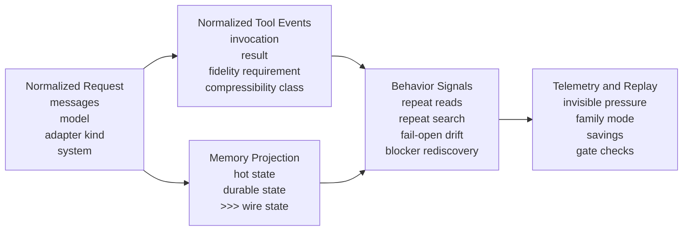
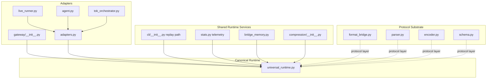
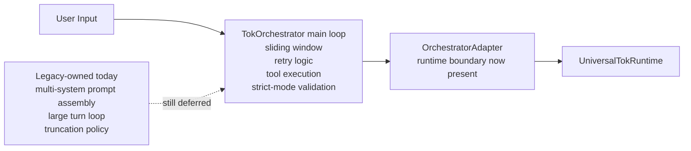
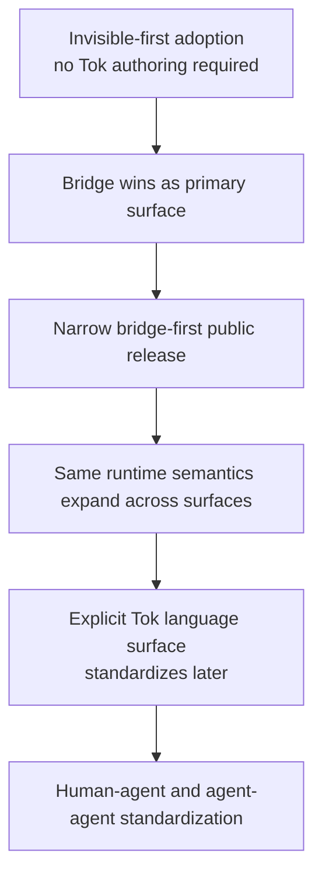

# Architecture Diagrams

This page is the visual companion to [architecture.md](./architecture.md). It shows the post-refactor system as it exists after the universal runtime consolidation.

## 1. Runtime Topology

## 2. Primary Claude Bridge Request Flow

## 3. Primary Claude Bridge Response Flow

## 4. Memory, Tools, and Telemetry Ontology

## 5. Runtime Surfaces and Ownership

## 6. Deferred Orchestrator Migration Boundary

## 7. Adoption Story

---

See [roadmap.md](../roadmap.md) for latest planning and phase status.
