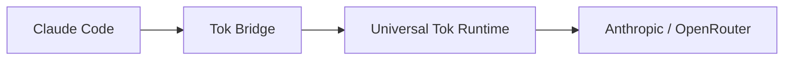

# Bridge Tutorial

This is the full bridge-first walkthrough for Tok.

If you are new to Tok, start with the quickstart in [`README.md`](../README.md), then
use this page when you want the complete operating flow.

Tok's first open-source release is intentionally narrow and Claude-first:

- install the Python package
- launch Claude through `tok claude`
- diagnose with `status`, `doctor`, `stats`, and logs

The bridge is the supported product path. Broader platform and SDK work come later. The
default CLI help intentionally centers that bridge-first path for `0.2.x`.

## What The Bridge Does

The Tok bridge sits between Claude Code and the upstream model API:



The bridge is responsible for transport and process lifecycle. The shared runtime owns:

- request shaping and history compression
- response classification and translation
- memory projection and update
- telemetry and invisible-pressure signals

## Prerequisites

- Python `3.10` or newer
- macOS or Linux
- Claude Code installed and available as `claude`
- provider/API configuration that already works with Claude Code

## Quickstart

```bash
pip install tok-protocol
tok claude
tok bridge status
tok doctor
tok bridge stop
tok stats
```

If you want an isolated CLI install and already use `pipx`, `pipx install tok-protocol`
works too. `tok claude` starts the bridge if needed and launches Claude Code with the
bridge environment set for that process only.

`tok install` is a setup/migration helper and does not wrap `claude` by default. If you
want legacy auto-routing behavior, use `tok install --wrap-claude`.

## What Success Looks Like

In a healthy session:

- `tok bridge status` shows the bridge running and Tok active
- `tok doctor` ends with `Recommendation: keep Tok on`
- `tok stats` shows saved dollars, saved percent, and `With Tok vs without Tok`

Typical output shape:

```bash
tok bridge status
# Bridge running on :9090 (PID 12345)
# Bridge Status
# Saved $0.0123 • 48.1% saved
# Verdict                Tok active and helping
# Session quality        clean
# Tok active             yes
# Degraded to baseline   no
# Fallbacks              0

tok doctor
# Current Session
# Saved $0.0123 • 48.1% saved
# Verdict                Tok active and helping
# Tok verdict: compression is active and saving tokens on the current session.
# Recommendation: keep Tok on

tok bridge stop
# Last Session
# Saved $0.0123 • 48.1% saved

tok stats
# Current Session
# Saved $0.0123 • 48.1% saved
# With Tok vs without Tok  45,000 / 86,700 tokens
```

Representative `tok stats --last-session` capture:

```text
╭──────────────── Last Completed Session ─────────────────╮
│ Saved $0.0001 • 30.4% saved                             │
│ Solid savings • 28 tokens avoided                       │
│ Date                               2026-03-20T11:24:26Z │
│ Turns                                                 1 │
│ With Tok vs without Tok                317 / 345 tokens │
│ Cost                                  $0.0003 / $0.0004 │
╰─────────────────────────────────────────────────────────╯
```

The key fields to watch are:

- `Verdict`
- `Mode`
- `Session quality`
- `Degraded to baseline`
- `Fallbacks`
- `Saved $` / `% saved`

## When To Use Baseline

If you want to compare Tok against no compression:

```bash
TOK_MODE=baseline tok bridge start
claude
tok stats
```

That gives you a clean control path for the same workflow.

## Bridge Commands

### Start

```bash
tok bridge start
tok bridge start --foreground
tok bridge start --debug
tok bridge start --capture
tok bridge start --port 8080
tok bridge start --no-fail-open
```

Use `--foreground` for the fastest debugging loop when setup is not behaving the way you
expect.

### Status

`tok bridge status` answers:

- is the bridge running?
- which mode is it in?
- is the session `clean`, `watch`, or `degraded`?
- has the session degraded to baseline?
- are savings visible yet?

### Doctor

`tok doctor` is the fastest “is Tok helping right now?” command. It now ends with a
concrete recommendation:

- `Recommendation: keep Tok on`
- `Recommendation: keep Tok on, but watch this session`
- `Recommendation: investigate degradation before trusting this session`

### Stop

`tok bridge stop` prints a compact session summary, which makes it the easiest
end-of-session checkpoint. If you call it from an active bridged Claude turn, it now
refuses by default to avoid self-cutoff; use `tok bridge stop --force` only when
intentional.

### Logs

```bash
tok bridge logs
tok bridge logs 100
```

Use logs when the bridge process exists but `status` or `doctor` suggest fallback or a
non-responsive session.

## Runtime Defaults

- default request policy: `natural_first` (`natural-first` in status output)
- legacy rollback path: `legacy_tool_compatible`
- default posture: compress aggressively, shape behavior conservatively
- conservative fallback: `baseline`
- non-default: `tok-minimal`
- non-default: `tok-native`
- OpenRouter/frontier runs are advisory validation, not the source of the public default

To force baseline:

```bash
TOK_MODE=baseline tok bridge start
```

To force the older compatibility path:

```bash
TOK_REQUEST_POLICY=legacy_tool_compatible tok bridge start
```

## Troubleshooting Basics

### `Degraded to baseline: yes`

The current session degraded to baseline for safety.

Check:

- `tok doctor`
- `tok stats`
- bridge logs for `tok_fallback_activated`

### Fallback count is rising

Tok is protecting the session by serving some requests without compression.

Search the bridge logs for:

- `tok_fallback_activated`
- `processing_error`
- `tok_fail_open_retry`

### Savings are not obvious

Run:

```bash
tok bridge stop
tok stats --last-session
tok stats --recent 5
tok capture-summary ~/.tok/sessions/<capture>.jsonl
tok capture-review ~/.tok/sessions --candidates
tok evidence-gap ~/.tok/sessions --stress-dir tmp/stress_language/<timestamp>
```

This usually gives a cleaner picture than lifetime totals alone.

These capture files are maintainer diagnostics. Tok redacts obvious bearer/API-key
material before writing them, but captures can still contain session content and should
be reviewed before sharing.

### `Session quality: watch`

Tok is still saving tokens, but the session shows some friction such as fallback,
reacquisition, or response-contract drift.

Keep Tok on, but inspect the degradation reason before deciding the bridge is at fault.

## Next Docs

- [`docs/cli-reference.md`](./cli-reference.md) for the command surface
- [`docs/diagnostics.md`](./diagnostics.md) for interpreting `status`, `doctor`, and
  common recovery signals like `compat-fallback` and `answer_ready_*`
- [`docs/troubleshooting.md`](./troubleshooting.md) for fallback and degraded-session
  diagnosis
- [`docs/production-readiness.md`](./production-readiness.md) for advanced runtime
  defaults and release posture
- [`docs/architecture.md`](./architecture.md) for deep runtime details
